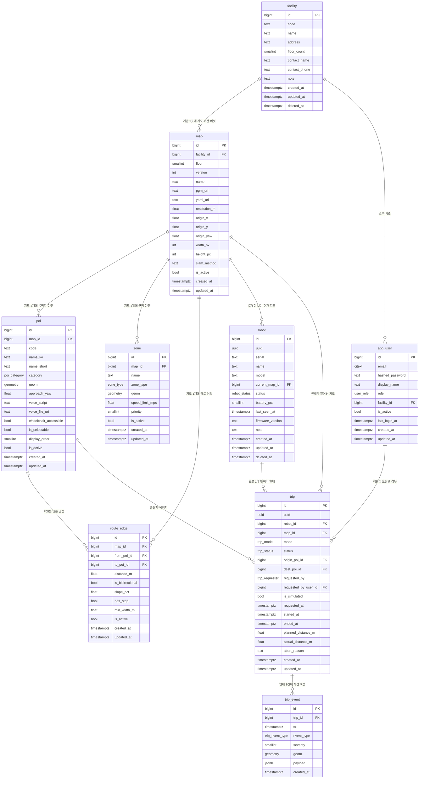

# ERD — 1차 스키마

`schema/001_phase1.sql` 이 만든 **실제 DB에서 뽑아낸** 다이어그램이다.
손으로 그린 게 아니라 `information_schema` 를 읽어 생성했으므로 스키마와 어긋나지 않는다.

> GitHub에서 이 파일을 열면 그림으로 렌더링된다.
> 발표 자료용 이미지는 같은 폴더의 `ERD.png` (2400px) 와 `ERD.svg` (확대해도 안 깨짐).
> 다이어그램 원본은 `ERD.mmd`.
>
> **dbdiagram.io 에서 편집하려면** `ERD.dbml` 내용을 통째로 복사해
> [dbdiagram.io](https://dbdiagram.io) 왼쪽 편집창에 붙여넣으면 된다.
> ENUM 8개, 테이블 9개, 관계 14개, ON DELETE 규칙, 테이블 그룹까지 들어있다.

---

## 전체 관계



---

## 읽는 법

`||--o{` 는 **1 : N** 관계다. 왼쪽 하나에 오른쪽이 여럿 달린다.
예: `facility ||--o{ map` = 복지관 한 곳에 지도 버전이 여러 개.

---

## 핵심 구조 3가지

### 1. 모든 공간 데이터는 `map`에 매달린다

```
map ──< poi
    ──< zone
    ──< route_edge
```

SLAM을 다시 돌리면 좌표계가 통째로 바뀐다.
지도가 바뀌었는데 POI 좌표가 옛날 것이면 **로봇이 벽으로 간다.**
그래서 `map`은 덮어쓰지 않고 **버전 레코드를 새로 만든다.**
`uq_map_active_per_floor` 인덱스가 "한 층에 활성 지도는 하나"를 강제한다.

### 2. `trip`이 로봇·지도·목적지·직원을 잇는 교차점

```
robot ──< trip >── poi (출발/도착)
                >── map
                >── app_user
         trip ──< trip_event
```

`trip` = 안내 요청 1건. 여기서 "누가 언제 어디서 어디로, 성공했는지"가 다 나온다.
`trip_event`는 그 안에서 일어난 사건(장애물, 비상정지, 재계획)이고 **좌표를 가진다.**
→ "어느 지점에서 자꾸 막히나"를 지도 위에 찍을 수 있다.

### 3. `route_edge`가 베리어프리 판정을 담당

`poi` 두 개를 잇는 간선에 **통로 폭 / 계단 유무 / 경사도**가 붙어 있다.
이 세 컬럼이 이 프로젝트를 "베리어프리" 로봇으로 만든다. 없으면 평범한 안내 로봇이다.

---

## 삭제 규칙 (ON DELETE)

| 관계 | 규칙 | 이유 |
|---|---|---|
| `map` → `poi`, `zone`, `route_edge` | CASCADE | 지도가 사라지면 그 좌표들은 의미가 없다 |
| `trip` → `trip_event` | CASCADE | 안내 기록이 지워지면 그 안의 사건도 함께 |
| `robot`, `map` → `trip` | **RESTRICT** | 과거 안내 기록이 있으면 로봇·지도를 못 지운다 |
| `poi` → `trip` | SET NULL | 목적지가 없어져도 "언제 몇 건 안내했는지" 통계는 남아야 한다 |
| `facility` → `map` | RESTRICT | 지도가 있는 기관은 못 지운다 |

> 실제로는 마스터 데이터를 **물리 삭제하지 않는다.** `is_active = false` 를 쓴다.
> 위 규칙은 최후의 안전망이다.

---

## 아직 없는 테이블 (2·3차)

| 차수 | 테이블 | 대기 중인 것 |
|---|---|---|
| 2차 | `label_class`, `data_file`, `annotation`, `dataset`, `dataset_item`, `model_run` | AI팀 라벨 클래스 목록 |
| 3차 | `pose_log`, `detection_log` (월 단위 파티션) | 로그 발행 주기(Hz) |

설계 근거는 `docs/DB-PHASE1.md` 참고.
