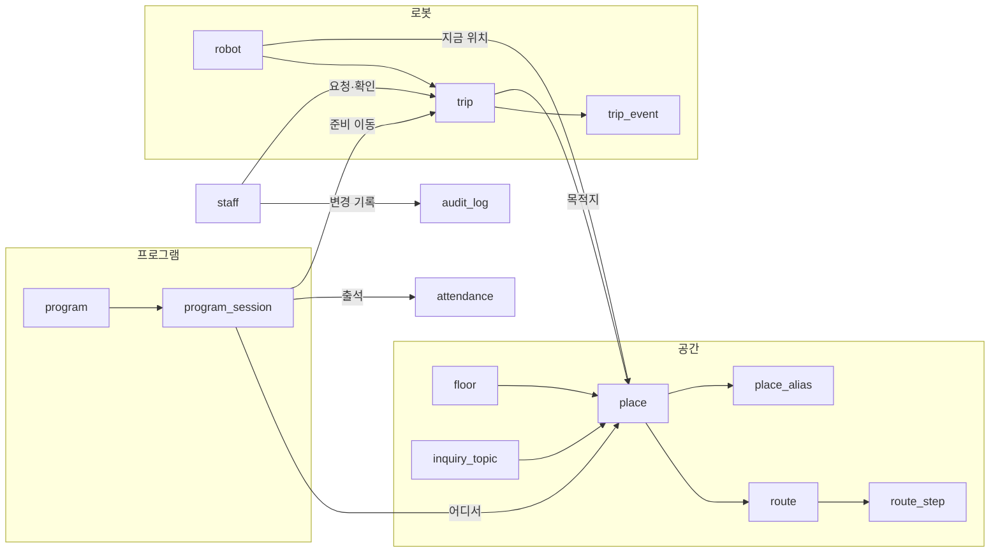
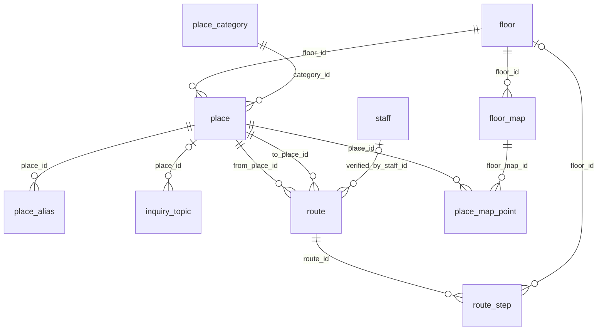
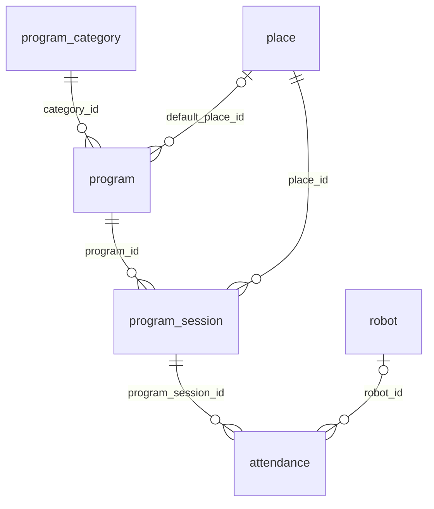
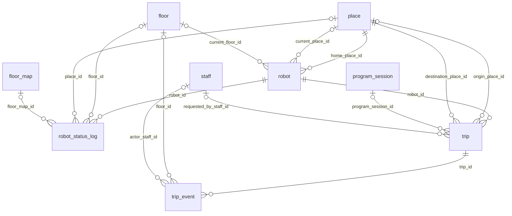
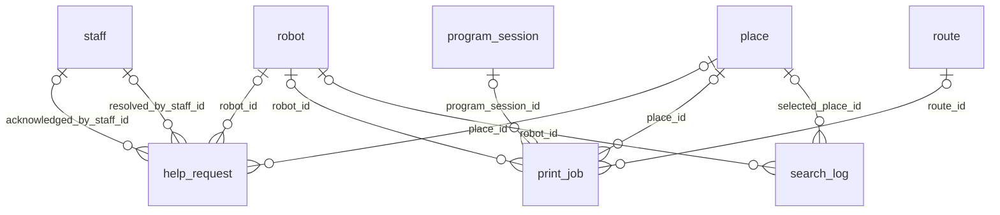
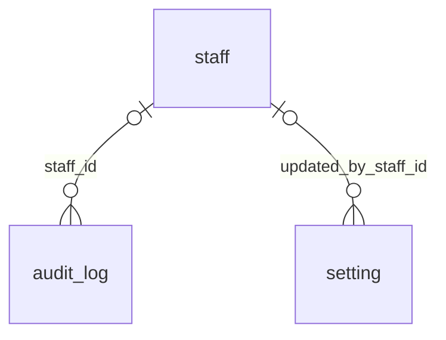
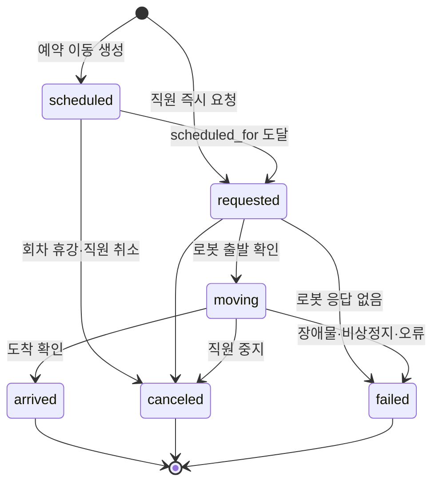
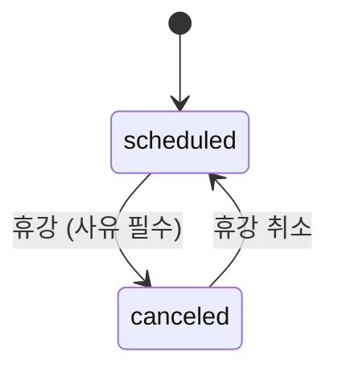
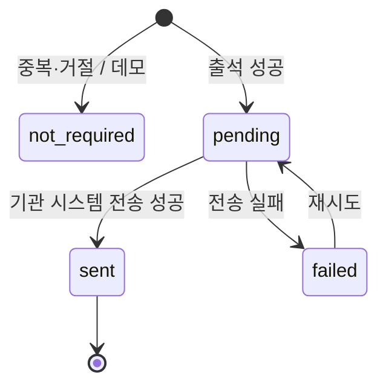
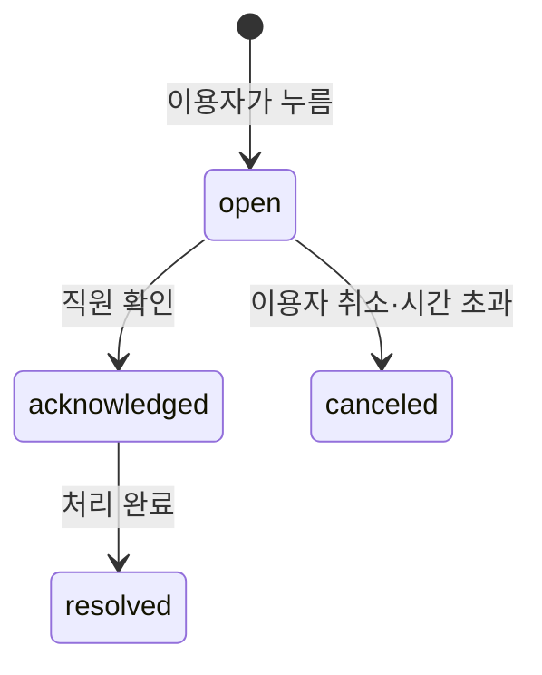

# ERD — 전체 DB 설계 (초안 v2)

> 작성: 2026-09-17 · 상태: **설계 초안. 아직 코드에 반영하지 않았다.**
> 원본: [`ERD.dbml`](ERD.dbml) — [dbdiagram.io](https://dbdiagram.io/d) 왼쪽 편집창에 통째로 붙여넣으면 그림이 나온다.
> 이 문서의 컬럼 표는 `ERD.dbml` 에서 자동으로 뽑았다. **컬럼을 바꿀 땐 `ERD.dbml` 을 먼저 고친다.**
>
> 옛 PostgreSQL 설계(`docs/archive/ERD.*`)는 안내 로봇 중심이라 이 문서로 대체한다.
> 좌표 버전 관리, 로봇키 SHA-256, 부분 유니크 인덱스 같은 교훈은 그대로 가져왔다.

---

## 목차

1. [한눈에 보기](#1-한눈에-보기)
2. [공통 규칙](#2-공통-규칙)
3. [전체 관계도](#3-전체-관계도)
4. [영역별 테이블 상세](#4-영역별-테이블-상세)
5. [상태 전이](#5-상태-전이)
6. [화면별 조회 경로](#6-화면별-조회-경로)
7. [지금 코드와 달라지는 점](#7-지금-코드와-달라지는-점)
8. [결정이 필요한 것](#8-결정이-필요한-것)

---

## 1. 한눈에 보기

계획서의 요구사항을 테이블에 대응시켰다. **요구사항에 없는 테이블은 만들지 않았다.**

| 계획서 요구 | 담당 테이블 |
|---|---|
| 3-1 행사 및 프로그램 확인 | `program_category` `program` `program_session` |
| 3-1 강의실 및 장소 길찾기 | `floor` `place` `place_category` `place_alias` `route` `route_step` |
| 3-1 문의 장소와 해당 장소 길찾기 | `inquiry_topic` → `place` → `route` |
| 3-1 바코드로 출석체크 (기관 방식) | `attendance` |
| 3-1 / 4 영수증 형태 출력 | `print_job` |
| 3-2 호출용 웹, 몇 층 어느 강의실로 이동 | `trip` `trip_event` `staff` |
| 5 로비 배치 / 필요 시 이동 / 복귀 | `robot.home_place_id`, `trip.purpose` |
| 5 프로그램 시작 전 강의실 앞 이동 | `program_session.needs_robot_prep`, `trip.purpose = program_prep` |
| 6 엘리베이터 층간 이동 | `floor.has_elevator_stop`, `trip_event` 엘리베이터 이벤트 |
| 7 이동 후 현재 위치에 맞는 안내 재개 | `robot.current_place_id` → `route.from_place_id` |
| 자율주행 지도·위치 | `floor_map` `place_map_point` `robot_status_log` |
| (운영) 누가 무엇을 바꿨나 | `staff` `audit_log` `setting` |

### 구현 단계

| 단계 | 테이블 | 조건 |
|---|---|---|
| **1차 — 지금 만든다** (17개) | floor, place_category, place, place_alias, inquiry_topic, route, route_step, program_category, program, program_session, attendance, robot, trip, trip_event, staff, audit_log, setting | 다른 팀 자료 없이도 구조를 만들 수 있다 |
| **2차 — 자료가 오면** (6개) | floor_map, place_map_point, robot_status_log | 시뮬레이션팀 지도·좌표·상태 규격 |
| | print_job | 프린터 기종 |
| | help_request | 기능 범위 확인 (§8) |
| | search_log | 보존기간 결정 (§8) |

1차 테이블 중에도 **외부 규격이 와야 채워지는 컬럼**이 있다.
`attendance.sync_*`·`external_ref`(기관 출결 API), `trip_event` 의 엘리베이터 이벤트(로봇 API) 등이다.
구조만 먼저 두고 값은 비워둔다 — "구조는 지금, 값은 나중에".

---

## 2. 공통 규칙

### 2.1 ID — 정수 PK + 사람이 읽는 `code`

| 테이블 종류 | PK | 추가 식별자 |
|---|---|---|
| 마스터 (floor, place, program ...) | `id integer` 자동 증가 | `code text UNIQUE` — JSON 가져오기·URL 용 |
| 기록 (attendance, trip_event, audit_log ...) | `id integer` 자동 증가 | 없음 |
| 외부와 주고받는 기록 (trip) | `id integer` | `public_id text UNIQUE` (UUID) |
| 설정 (setting) | `key text` | — |

**왜:** 지금은 `place.id = 'demo-lobby'` 처럼 문자열이 PK 다.
그러면 코드 이름을 고칠 때 모든 FK 를 같이 고쳐야 한다. 정수 PK 로 FK 를 잇고, 이름표는 `code` 로 따로 둔다.
SQLite 는 `INTEGER PRIMARY KEY` 가 내부 rowid 라 조인도 가장 빠르다.
trip 은 로봇·시뮬레이션팀과 ID 를 주고받으므로 순번이 드러나지 않는 UUID 를 한 번 더 둔다.

### 2.2 시각 — 형식을 **하나로 고정**한다 ⚠️

SQLite 에는 날짜 타입이 없다. 시각은 문자열이고, **정렬·비교도 문자열 비교**다.
형식이 섞이면 조용히 틀린다.

```
YYYY-MM-DDTHH:MM:SS.sssZ      예) 2026-09-17T00:30:00.000Z   (항상 24자, 항상 UTC, 항상 Z)
```

- 자바스크립트 `new Date().toISOString()` 결과와 **정확히 같은 형식**이다.
- 파이썬은 `datetime.isoformat()` 이 `+00:00` 과 마이크로초(6자리)를 내므로 **그대로 쓰면 안 된다.** 공용 헬퍼 하나로만 만든다.
- CHECK 로 형식을 강제한다:
  ```sql
  CHECK (created_at GLOB '[0-9][0-9][0-9][0-9]-[01][0-9]-[0-3][0-9]T[0-2][0-9]:[0-5][0-9]:[0-5][0-9].[0-9][0-9][0-9]Z')
  ```

> **2026-09-17 해결됨.** 전에는 `models.utc_now()` 가 `...123456+00:00`, Pydantic 이 저장한
> `starts_at` 이 `...00Z` 로 섞여 있었다. 지금은 저장 경로가 전부 `models.iso_z()` 하나를 거친다.
> `tests_web/test_api.py` 의 `test_every_stored_timestamp_uses_one_format` 이 다시 섞이는 것을 막는다.
> DB 층의 CHECK 는 아직 없다 — v2 baseline 마이그레이션을 만들 때 같이 넣는다.

### 2.3 한국 날짜 컬럼 `*_day_kst`

"오늘 프로그램", "오늘 출석 수" 는 **한국 날짜** 기준이다. UTC 로 자르면 오전 9시 전 기록이 전날로 간다.
SQLite 로 매번 `date(starts_at, '+9 hours')` 를 계산하면 인덱스를 못 탄다.
→ 저장할 때 `YYYY-MM-DD`(KST) 를 같이 넣고 인덱스를 건다.

| 컬럼 | 원본 시각 |
|---|---|
| `program_session.session_day_kst` | `starts_at` |
| `attendance.checked_day_kst` | `checked_at` |
| `robot_status_log.recorded_day_kst` | `recorded_at` |
| `print_job.requested_day_kst` | `requested_at` |
| `search_log.searched_day_kst` | `searched_at` |

한국은 서머타임이 없어 `UTC + 9시간` 으로 계산이 항상 맞는다. 원본을 고치면 같이 고친다.

### 2.4 불리언

SQLite 에는 불리언이 없어 `0/1` 정수다. SQLAlchemy 2.0 의 `Boolean` 은 기본으로 CHECK 를 만들지 않으므로
`Boolean(create_constraint=True, name=...)` 으로 `CHECK (x IN (0,1))` 를 붙인다.

### 2.5 삭제하지 않는다

| 종류 | 방식 |
|---|---|
| 마스터 (floor, place, program, robot, staff, category ...) | `is_active = 0` 으로 숨긴다 |
| 회차 | `status = 'canceled'` |
| 기록 (attendance, trip, trip_event, audit_log ...) | 추가만 한다 |
| 대용량 로그 (robot_status_log, search_log) | 보존기간 지나면 정리 — 유일한 물리 삭제 예외 |
| 딸린 행 (place_alias, route_step) | 부모와 함께 편집. `ON DELETE CASCADE` |

그래서 FK 대부분이 `ON DELETE RESTRICT` 다. 실수로 지우려 해도 DB 가 막는다.
**`PRAGMA foreign_keys = ON` 이 없으면 SQLite 는 FK 를 전혀 검사하지 않는다.** (`web_api/db.py` 에 이미 있음)

### 2.6 CHECK·부분 유니크는 `models.py` 에 전부 선언

dbdiagram(DBML) 은 CHECK 와 `WHERE` 가 붙은 인덱스를 그리지 못해서 각 테이블 **Note** 에 적었다.
구현할 때는 `__table_args__` 에 전부 옮긴다. 안 적으면 Alembic autogenerate 가 DROP 을 만든다 (PITFALLS B-1).

```python
Index("uq_trip_robot_active", "robot_id", unique=True,
      sqlite_where=text("status IN ('requested','moving')"))
```

### 2.7 개인정보

| 원칙 | 적용 |
|---|---|
| 회원번호·QR 원문은 어디에도 저장하지 않는다 | `attendance.member_token` = HMAC-SHA256 |
| 이용자 계정·이름·연락처를 받지 않는다 | 이용자 테이블 없음 |
| 인쇄 내용·도움 요청에 개인정보를 넣지 않는다 | `print_job.content_snapshot`, `help_request` |
| 감사 로그에 비밀값을 넣지 않는다 | `audit_log` 에서 해시 컬럼 제외 |

### 2.8 파일은 DB 에 넣지 않는다

지도 이미지, 길찾기 사진은 파일로 두고 DB 에는 `*_uri` + `sha256` 만. SQLite 파일이 커지면 백업·복사가 느려진다.

### 2.9 SQLite 운영 설정 (구현 시 추가)

| 설정 | 이유 |
|---|---|
| `PRAGMA foreign_keys = ON` | FK 검사 (이미 있음) |
| `PRAGMA busy_timeout = 5000` | 동시 쓰기 대기 (이미 있음) |
| `PRAGMA journal_mode = WAL` | 키오스크 조회와 직원 저장이 동시에 일어나도 읽기가 막히지 않음 (**추가 필요**) |

---

## 3. 전체 관계도

GitHub 에서 그림으로 보인다. **컬럼까지 한 장으로 보려면 `ERD.dbml` 을 dbdiagram.io 에 붙여넣는다.**

### 영역 사이의 큰 흐름



### 영역별 관계 (FK 45개 전부)

한 장에 23개를 그리면 글자가 안 보여서 **FK 를 가진 쪽 테이블의 영역**으로 나눴다.
`||--o{` 는 "반드시 1개 : 여러 개", `|o--o{` 는 "없을 수도 있음 : 여러 개". 선 위 글자는 FK 컬럼 이름.

#### 4.1 공간



#### 4.2~4.3 프로그램·출결



#### 4.4 로봇·이동



#### 4.5 이용자 지원



#### 4.6 직원·운영



---

## 4. 영역별 테이블 상세

표의 `필수 ●` 는 NOT NULL. 모든 `created_at` `updated_at` 은 §2.2 형식이다.

### 4.1 공간

#### `floor` — 층 · 1차

| 컬럼 | 타입 | 필수 | 기본값 | 키 | 설명 |
|---|---|:-:|---|---|---|
| `id` | integer | ● |  | PK |  |
| `code` | text | ● |  | UQ | 가져오기·API 식별자. 형식 예: B1, 1F |
| `level` | integer | ● |  | UQ | 층 순서. 지하1층=-1, 1층=1. 0 없음 |
| `label` | text | ● |  |  | 화면 표시. 형식 예: 지하 1층 |
| `has_elevator_stop` | boolean | ● | `true` |  | 엘리베이터가 서는 층인지 (로봇 층간 이동 가능 여부) |
| `sort_order` | integer | ● | `0` |  |  |
| `is_active` | boolean | ● | `true` |  |  |
| `created_at` | text | ● |  |  |  |
| `updated_at` | text | ● |  |  |  |

- `level` 과 `label` 을 나눈 이유: 정렬·층간 계산은 숫자로, 화면은 "지하 1층" 같은 기관 표기로.
- `has_elevator_stop = 0` 인 층은 로봇 목적지 목록에서 뺀다 (계획서 6번 엘리베이터 이동 전제).
- **CHECK** `level <> 0`, `level BETWEEN -10 AND 100`

#### `place_category` — 장소 구분 · 1차

| 컬럼 | 타입 | 필수 | 기본값 | 키 | 설명 |
|---|---|:-:|---|---|---|
| `id` | integer | ● |  | PK |  |
| `code` | text | ● |  | UQ | 영문 식별자 |
| `name` | text | ● |  | UQ | 화면 표시. 현재 코드값: 안내, 강의실, 편의시설, 상담 |
| `sort_order` | integer | ● | `0` |  |  |
| `is_active` | boolean | ● | `true` |  |  |
| `created_at` | text | ● |  |  |  |
| `updated_at` | text | ● |  |  |  |

- 첫 데이터는 지금 코드에 있는 4개(안내, 강의실, 편의시설, 상담)를 그대로 옮긴다.

#### `place` — 장소 · 1차

| 컬럼 | 타입 | 필수 | 기본값 | 키 | 설명 |
|---|---|:-:|---|---|---|
| `id` | integer | ● |  | PK |  |
| `code` | text | ● |  | UQ | 가져오기 JSON·URL 용. 영문·숫자·-·_ 1~64자 |
| `floor_id` | integer | ● |  | FK → `floor.id` |  |
| `category_id` | integer | ● |  | FK → `place_category.id` |  |
| `name` | text | ● |  |  | 1~100자 |
| `short_name` | text |  |  |  | 영수증·좁은 화면용 짧은 이름. 없으면 name |
| `room_label` | text |  |  |  | 문 앞 실 번호 표지 그대로. 형식 예: 201호 |
| `description` | text | ● | `''` |  |  |
| `accessibility` | text | ● | `unknown` |  | accessible / partial / not_accessible / unknown |
| `accessibility_note` | text |  |  |  | 예: 문턱 있음, 경사로 이용 |
| `is_listed` | boolean | ● | `true` |  | 이용자 목록·검색에 보이는지 |
| `is_robot_reachable` | boolean | ● | `false` |  | 로봇 이동 목적지로 고를 수 있는지 (시뮬레이션팀 확인 후 1) |
| `sort_order` | integer | ● | `0` |  |  |
| `is_active` | boolean | ● | `true` |  |  |
| `created_at` | text | ● |  |  |  |
| `updated_at` | text | ● |  |  |  |

- **`accessibility` 4단계:** 지금 `wheelchair_accessible = false` 는 "못 간다" 인지 "모른다" 인지 알 수 없다.
  어르신에게 잘못된 "이용 가능" 을 보여주는 게 가장 위험하므로 기본값은 `unknown`.
- **`is_listed` vs `is_robot_reachable`:** 이용자에게 보여줄 장소와 로봇이 갈 수 있는 장소는 다르다.
  (예: 엘리베이터 앞은 로봇 대기 지점이지만 이용자 목록엔 필요 없다.) 로봇 도달 여부는 시뮬레이션팀이 확인한 뒤 켠다.
- **CHECK** `accessibility IN ('accessible','partial','not_accessible','unknown')`, `length(name) BETWEEN 1 AND 100`,
  `code NOT GLOB '*[^A-Za-z0-9_-]*' AND length(code) BETWEEN 1 AND 64`
- **부분 유니크** `uq_place_floor_name_active (floor_id, name) WHERE is_active = 1`

#### `place_alias` — 장소 별칭 · 1차

| 컬럼 | 타입 | 필수 | 기본값 | 키 | 설명 |
|---|---|:-:|---|---|---|
| `id` | integer | ● |  | PK |  |
| `place_id` | integer | ● |  | FK → `place.id` |  |
| `alias` | text | ● |  |  | 다르게 부르는 이름. 형식 예: 정식 명칭 대신 쓰는 통칭 |
| `alias_normalized` | text | ● |  |  | 공백 제거·소문자. hangulSearch.ts normalize() 와 같은 규칙 |
| `created_at` | text | ● |  |  |  |

- 검색은 `place.name` + `place_alias.alias` 를 함께 본다. 초성 검색 규칙은 [`web/src/hangulSearch.ts`](../web/src/hangulSearch.ts).
- `alias_normalized` 는 서버에서 같은 별칭이 두 번 들어가는 걸 막기 위한 값이다. 앱이 저장할 때 계산한다.

#### `inquiry_topic` — 문의 주제 · 1차

| 컬럼 | 타입 | 필수 | 기본값 | 키 | 설명 |
|---|---|:-:|---|---|---|
| `id` | integer | ● |  | PK |  |
| `code` | text | ● |  | UQ |  |
| `question` | text | ● |  |  | 이용자가 누르는 질문 문장 |
| `answer` | text | ● | `''` |  | 짧은 답. 장소 안내가 필요 없으면 이것만 |
| `place_id` | integer |  |  | FK → `place.id` | 안내할 장소. 없으면 answer 만 보여준다 |
| `sort_order` | integer | ● | `0` |  |  |
| `is_active` | boolean | ● | `true` |  |  |
| `created_at` | text | ● |  |  |  |
| `updated_at` | text | ● |  |  |  |

- 계획서 "문의 장소와 해당 장소 길찾기" 를 위한 테이블.
  이용자는 장소 이름을 몰라도 **하고 싶은 일(질문)** 로 찾는다 → 담당 장소 → 길찾기.
- `place_id` 없이 `answer` 만 있는 질문도 허용한다 (장소 안내가 필요 없는 답).
- 질문 목록은 **기관에서 받아** 채운다.

#### `route` — 길찾기 경로 · 1차

| 컬럼 | 타입 | 필수 | 기본값 | 키 | 설명 |
|---|---|:-:|---|---|---|
| `id` | integer | ● |  | PK |  |
| `from_place_id` | integer | ● |  | FK → `place.id` | 출발 위치 = 키오스크(로봇)가 서 있는 장소 |
| `to_place_id` | integer | ● |  | FK → `place.id` |  |
| `is_barrier_free` | boolean | ● | `false` |  | 계단·문턱 없이 갈 수 있는 경로인지 |
| `uses_elevator` | boolean | ● | `false` |  |  |
| `estimated_minutes` | integer |  |  |  | 어르신 걸음 기준 예상 시간 |
| `verification` | text | ● | `draft` |  | draft / staff_checked / simulation_verified |
| `verified_at` | text |  |  |  |  |
| `verified_by_staff_id` | integer |  |  | FK → `staff.id` |  |
| `is_active` | boolean | ● | `true` |  |  |
| `created_at` | text | ● |  |  |  |
| `updated_at` | text | ● |  |  |  |

- **출발지가 있는 이유:** 로봇이 로비에 있을 때와 2층 강의실 앞에 있을 때 안내 문장이 다르다 (계획서 7번).
  화면은 `robot.current_place_id` 로 경로를 고르고, 없으면 `robot.home_place_id` 기준 경로를 보여준다.
- **`is_barrier_free`:** 같은 출발·도착이라도 계단 경로와 엘리베이터 경로를 따로 둘 수 있다. 키오스크는 무장애 경로를 먼저 보여준다.
- **`verification`:** 직원이 걸어보고 적은 안내(`staff_checked`)와 시뮬레이션팀이 검증한 경로(`simulation_verified`)를 구분한다.
  `draft` 는 이용자 화면에 "확인 중인 안내" 로 표시한다.
- **CHECK** `from_place_id <> to_place_id`, `verification IN (...)`, `estimated_minutes BETWEEN 1 AND 120`,
  `verification = 'draft' OR verified_at IS NOT NULL`
- **부분 유니크** `uq_route_active (from_place_id, to_place_id, is_barrier_free) WHERE is_active = 1`

#### `route_step` — 길찾기 단계 · 1차

| 컬럼 | 타입 | 필수 | 기본값 | 키 | 설명 |
|---|---|:-:|---|---|---|
| `id` | integer | ● |  | PK |  |
| `route_id` | integer | ● |  | FK → `route.id` |  |
| `step_no` | integer | ● |  |  | 1부터 |
| `instruction` | text | ● |  |  | 한 단계 안내 문장. 1~200자 |
| `floor_id` | integer |  |  | FK → `floor.id` | 이 단계가 일어나는 층 (엘리베이터 전후 표시용) |
| `landmark` | text |  |  |  | 눈에 띄는 표지. 예: 엘리베이터 앞 게시판 |
| `image_uri` | text |  |  |  | 사진 파일 경로. 파일은 DB 에 넣지 않는다 |
| `created_at` | text | ● |  |  |  |
| `updated_at` | text | ● |  |  |  |

- 지금 `place.directions` 가 JSON 배열인 것을 행으로 뺐다. 단계별 층·표지·사진을 붙이고, DB 관리 화면에서 순서를 바꾸기 쉽게.
- **CHECK** `step_no BETWEEN 1 AND 30`, `length(instruction) BETWEEN 1 AND 200`

#### `floor_map` — 층 지도 버전 · 2차

| 컬럼 | 타입 | 필수 | 기본값 | 키 | 설명 |
|---|---|:-:|---|---|---|
| `id` | integer | ● |  | PK |  |
| `floor_id` | integer | ● |  | FK → `floor.id` |  |
| `version` | integer | ● |  |  | 층마다 1부터 증가. 덮어쓰지 않는다 |
| `source` | text | ● |  |  | slam / drawing |
| `image_uri` | text | ● |  |  | 파일 경로. bytea/BLOB 금지 |
| `image_sha256` | text | ● |  |  |  |
| `width_px` | integer |  |  |  |  |
| `height_px` | integer |  |  |  |  |
| `meters_per_px` | real |  |  |  | SLAM 해상도. 시뮬레이션팀 규격 대기 |
| `origin_x` | real |  |  |  |  |
| `origin_y` | real |  |  |  |  |
| `is_active` | boolean | ● | `false` |  |  |
| `note` | text |  |  |  |  |
| `created_at` | text | ● |  |  |  |

- SLAM 지도는 다시 만들면 원점이 바뀐다. 덮어쓰면 옛 좌표가 전부 틀어진다 → **새 버전 행**.
- 파일 형식·해상도·원점 규격은 시뮬레이션팀 자료를 받은 뒤 확정한다.
- **CHECK** `source IN ('slam','drawing')`, `length(image_sha256) = 64`
- **부분 유니크** `uq_floor_map_active (floor_id) WHERE is_active = 1`

#### `place_map_point` — 장소 좌표 · 2차

| 컬럼 | 타입 | 필수 | 기본값 | 키 | 설명 |
|---|---|:-:|---|---|---|
| `id` | integer | ● |  | PK |  |
| `place_id` | integer | ● |  | FK → `place.id` |  |
| `floor_map_id` | integer | ● |  | FK → `floor_map.id` |  |
| `point_kind` | text | ● |  |  | entrance / robot_stop |
| `x` | real | ● |  |  |  |
| `y` | real | ● |  |  |  |
| `yaw` | real |  |  |  | 로봇이 멈출 때 바라볼 방향 (라디안) |
| `created_at` | text | ● |  |  |  |
| `updated_at` | text | ● |  |  |  |

- `entrance`: 지도에 표시할 입구 위치 / `robot_stop`: 로봇이 멈출 위치와 방향.
- **앱 검증** 지도의 층과 장소의 층이 같아야 한다 (SQLite CHECK 는 다른 테이블을 못 본다).

### 4.2 프로그램

#### `program_category` — 프로그램 구분 · 1차

| 컬럼 | 타입 | 필수 | 기본값 | 키 | 설명 |
|---|---|:-:|---|---|---|
| `id` | integer | ● |  | PK |  |
| `code` | text | ● |  | UQ |  |
| `name` | text | ● |  | UQ | 현재 코드값: 건강, 문화, 디지털, 행사 |
| `color_token` | text |  |  |  | 화면 태그 색 이름. CSS 값 직접 저장 X |
| `sort_order` | integer | ● | `0` |  |  |
| `is_active` | boolean | ● | `true` |  |  |
| `created_at` | text | ● |  |  |  |
| `updated_at` | text | ● |  |  |  |

- 첫 데이터는 지금 코드의 4개(건강, 문화, 디지털, 행사).

#### `program` — 강좌·행사 · 1차

| 컬럼 | 타입 | 필수 | 기본값 | 키 | 설명 |
|---|---|:-:|---|---|---|
| `id` | integer | ● |  | PK |  |
| `code` | text | ● |  | UQ |  |
| `category_id` | integer | ● |  | FK → `program_category.id` |  |
| `kind` | text | ● | `class` |  | class(정기 강좌) / event(일회성 행사) |
| `title` | text | ● |  |  | 1~100자 |
| `description` | text | ● | `''` |  |  |
| `instructor_name` | text | ● | `''` |  | 강사 이름만. 연락처 저장 X |
| `target_audience` | text |  |  |  | 대상 설명 문구 |
| `default_place_id` | integer |  |  | FK → `place.id` | 회차 만들 때 기본 장소 |
| `capacity` | integer |  |  |  | 정원. 표시용. 신청 관리는 기관 시스템 |
| `requires_registration` | boolean | ● | `false` |  | 사전 신청 필요 표시 |
| `external_ref` | text |  |  |  | 기관 시스템의 프로그램 ID (연동 규격 대기) |
| `is_active` | boolean | ● | `true` |  |  |
| `created_at` | text | ● |  |  |  |
| `updated_at` | text | ● |  |  |  |

- **"무엇" 과 "언제·어디서" 를 나눈다.** 매주 화요일 체조 교실이면 `program` 1행 + `program_session` N행.
- `kind` 로 정기 강좌와 일회성 행사를 구분한다 (계획서 "행사 및 프로그램 확인").
- 신청·정원 관리는 기관 시스템 몫이다. `capacity`, `requires_registration` 은 **안내 표시용**.
- **CHECK** `kind IN ('class','event')`, `capacity BETWEEN 1 AND 1000`
- **부분 유니크** `uq_program_external_ref (external_ref) WHERE external_ref IS NOT NULL`

#### `program_session` — 회차 · 1차

| 컬럼 | 타입 | 필수 | 기본값 | 키 | 설명 |
|---|---|:-:|---|---|---|
| `id` | integer | ● |  | PK |  |
| `program_id` | integer | ● |  | FK → `program.id` |  |
| `place_id` | integer | ● |  | FK → `place.id` |  |
| `starts_at` | text | ● |  |  | UTC |
| `ends_at` | text | ● |  |  | UTC |
| `session_day_kst` | text | ● |  |  | starts_at 의 한국 날짜. 오늘 필터 인덱스용 |
| `status` | text | ● | `scheduled` |  | scheduled / canceled |
| `cancel_reason` | text |  |  |  |  |
| `attendance_open_minutes` | integer |  |  |  | 시작 몇 분 전부터 출석 받나. NULL 이면 setting 값 |
| `needs_robot_prep` | boolean | ● | `false` |  | 시작 전 로봇을 강의실 앞으로 보낼지 (계획서 5번) |
| `note` | text |  |  |  |  |
| `created_at` | text | ● |  |  |  |
| `updated_at` | text | ● |  |  |  |

- 출석, 예약 이동, 인쇄가 전부 **회차**를 가리킨다.
- 회차별로 장소가 바뀔 수 있으므로 `place_id` 는 회차에 둔다. `program.default_place_id` 는 입력 편의용.
- 휴강은 지우지 않고 `status = 'canceled'` + 사유. 키오스크는 "휴강" 으로 보여준다.
- **CHECK** `ends_at > starts_at`, `status IN ('scheduled','canceled')`, `status = 'scheduled' OR cancel_reason IS NOT NULL`,
  `attendance_open_minutes BETWEEN 0 AND 180`
- **앱 검증** 같은 장소에 시간이 겹치는 회차가 있으면 저장 전에 경고한다.

### 4.3 출결

#### `attendance` — 출석 시도 · 1차

| 컬럼 | 타입 | 필수 | 기본값 | 키 | 설명 |
|---|---|:-:|---|---|---|
| `id` | integer | ● |  | PK |  |
| `program_session_id` | integer | ● |  | FK → `program_session.id` |  |
| `member_token` | text | ● |  |  | HMAC-SHA256(서버 비밀키, 회원 코드) 16진수 64자. 원문 저장 금지 |
| `method` | text | ● |  |  | barcode / qr / manual |
| `result` | text | ● |  |  | accepted / duplicate / rejected |
| `reject_reason` | text |  |  |  | not_open_yet / closed / session_canceled / unknown_member / invalid_code |
| `robot_id` | integer |  |  | FK → `robot.id` | 어느 키오스크에서 찍었나 |
| `checked_at` | text | ● |  |  |  |
| `checked_day_kst` | text | ● |  |  |  |
| `sync_status` | text | ● |  |  | not_required / pending / sent / failed |
| `synced_at` | text |  |  |  |  |
| `sync_error` | text |  |  |  |  |
| `external_ref` | text |  |  |  | 기관 출결 시스템이 돌려준 ID (규격 대기) |
| `is_simulated` | boolean | ● | `true` |  |  |
| `created_at` | text | ● |  |  |  |

- **실패도 남긴다.** "스캔했는데 안 됐어요" 민원을 확인하려면 거절 사유가 있어야 한다.
- **`member_token` 은 HMAC:** 회원번호가 숫자 8자리라면 SHA-256 은 1억 번 계산으로 전부 복원된다(수 초).
  서버만 아는 비밀키(`WEB_MEMBER_TOKEN_KEY`)를 섞으면 DB 파일만 유출돼서는 복원할 수 없다.
  비밀키를 바꾸면 기존 토큰과 비교가 안 되므로 **키 교체 절차**를 같이 정한다.
- **전송 상태 (`sync_*`):** 기관 출결 시스템이 원본이다. 네트워크가 끊겨도 키오스크는 받아두고 `pending` → 나중에 `sent`.
- **CHECK** `method IN (...)`, `result IN (...)`, `(result = 'rejected') = (reject_reason IS NOT NULL)`,
  `sync_status IN (...)`, `result = 'accepted' OR sync_status = 'not_required'`, `length(member_token) = 64`
- **부분 유니크** `uq_attendance_accepted (program_session_id, member_token) WHERE result = 'accepted'`

### 4.4 로봇·이동

#### `robot` — 이동형 키오스크 · 1차

| 컬럼 | 타입 | 필수 | 기본값 | 키 | 설명 |
|---|---|:-:|---|---|---|
| `id` | integer | ● |  | PK |  |
| `code` | text | ● |  | UQ |  |
| `name` | text | ● |  |  |  |
| `model` | text |  |  |  |  |
| `home_place_id` | integer | ● |  | FK → `place.id` | 평소 대기 장소 (계획서 5번: 로비 배치) |
| `current_place_id` | integer |  |  | FK → `place.id` | 마지막으로 확인된 장소. 모르면 NULL |
| `current_floor_id` | integer |  |  | FK → `floor.id` |  |
| `state` | text | ● | `offline` |  | offline / idle / moving / charging / error / estop |
| `battery_pct` | integer |  |  |  |  |
| `last_seen_at` | text |  |  |  |  |
| `api_key_hash` | text |  |  | UQ | 로봇 인증키 SHA-256. bcrypt 금지 (조회 불가) |
| `connection` | text | ● | `simulated` |  | simulated / real |
| `is_active` | boolean | ● | `true` |  |  |
| `created_at` | text | ● |  |  |  |
| `updated_at` | text | ● |  |  |  |

- `current_place_id` 는 **마지막으로 확인된** 위치다. 모르면 NULL — 추정해서 채우지 않는다.
- `api_key_hash` 는 **SHA-256**. bcrypt 는 salt 가 매번 달라 키로 로봇을 찾을 수 없다 (PITFALLS C-3).
- `connection = 'simulated'` 인 동안 이동 요청은 실제로 전송되지 않는다. 화면에 "데모" 표시.
- **CHECK** `state IN (...)`, `connection IN ('simulated','real')`, `battery_pct BETWEEN 0 AND 100`, `length(api_key_hash) = 64`

#### `robot_status_log` — 로봇 상태 기록 · 2차

| 컬럼 | 타입 | 필수 | 기본값 | 키 | 설명 |
|---|---|:-:|---|---|---|
| `id` | integer | ● |  | PK |  |
| `robot_id` | integer | ● |  | FK → `robot.id` |  |
| `recorded_at` | text | ● |  |  |  |
| `recorded_day_kst` | text | ● |  |  |  |
| `state` | text | ● |  |  |  |
| `battery_pct` | integer |  |  |  |  |
| `floor_id` | integer |  |  | FK → `floor.id` |  |
| `place_id` | integer |  |  | FK → `place.id` |  |
| `floor_map_id` | integer |  |  | FK → `floor_map.id` |  |
| `x` | real |  |  |  |  |
| `y` | real |  |  |  |  |
| `payload` | json |  |  |  | 로봇이 보낸 나머지 값 그대로 |

- 저장 기준: **상태가 바뀔 때 + 일정 간격(예: 30초)**. 1초마다 저장하면 하루 8만 행이 넘는다.
- 로봇의 "지금" 값은 `robot` 에, "흐름" 은 여기에.

#### `trip` — 이동 요청 · 1차

| 컬럼 | 타입 | 필수 | 기본값 | 키 | 설명 |
|---|---|:-:|---|---|---|
| `id` | integer | ● |  | PK |  |
| `public_id` | text | ● |  | UQ | UUID. 로봇·시뮬레이션팀과 주고받는 ID |
| `robot_id` | integer | ● |  | FK → `robot.id` |  |
| `purpose` | text | ● |  |  | staff_request / program_prep / return_home / test |
| `origin_place_id` | integer |  |  | FK → `place.id` | 출발 당시 장소. 모르면 NULL |
| `destination_place_id` | integer | ● |  | FK → `place.id` |  |
| `program_session_id` | integer |  |  | FK → `program_session.id` | program_prep 일 때 어느 회차 준비인지 |
| `requested_by_staff_id` | integer |  |  | FK → `staff.id` | 직원이 요청했으면 누구인지 |
| `status` | text | ● |  |  | scheduled / requested / moving / arrived / canceled / failed |
| `scheduled_for` | text |  |  |  | 예약 이동: 이 시각에 requested 로 바뀐다 |
| `requested_at` | text |  |  |  |  |
| `started_at` | text |  |  |  |  |
| `arrived_at` | text |  |  |  |  |
| `ended_at` | text |  |  |  | arrived / canceled / failed 가 된 시각 |
| `cancel_reason` | text |  |  |  |  |
| `failure_reason` | text |  |  |  |  |
| `is_simulated` | boolean | ● | `true` |  |  |
| `created_at` | text | ● |  |  |  |
| `updated_at` | text | ● |  |  |  |

- **`purpose`** 가 계획서 5번의 네 가지 상황과 맞는다:

  | purpose | 상황 | 누가 만드나 |
  |---|---|---|
  | `staff_request` | 직원이 "몇 층 어느 강의실로" 선택 (3-2) | 직원 화면 |
  | `program_prep` | 프로그램 시작 전 강의실 앞으로 | 서버 예약 작업 |
  | `return_home` | 활동 끝나고 로비로 복귀 | 직원 또는 자동 |
  | `test` | 시험 주행 | 직원 |

- **예약 이동:** `needs_robot_prep = 1` 인 회차가 있으면 서버가 `status = 'scheduled'`, `scheduled_for = starts_at − N분` 으로 만들어 둔다.
  시각이 되면 `requested` 로 바꾼다. 로봇이 다른 이동 중이면 `uq_trip_robot_active` 에 걸리므로 대기 후 재시도.
- **CHECK** 7개 (Note 참고) — 핵심은 "목적에 맞는 값이 있는가":
  `purpose <> 'program_prep' OR program_session_id IS NOT NULL`, `status <> 'scheduled' OR scheduled_for IS NOT NULL`,
  `status NOT IN ('arrived','canceled','failed') OR ended_at IS NOT NULL`, 취소·실패 사유 필수, 출발지 ≠ 목적지
- **부분 유니크**
  - `uq_trip_robot_active (robot_id) WHERE status IN ('requested','moving')`
  - `uq_trip_session_prep (program_session_id) WHERE purpose = 'program_prep' AND status IN ('scheduled','requested','moving')`

#### `trip_event` — 이동 진행 기록 · 1차 (일부 2차)

| 컬럼 | 타입 | 필수 | 기본값 | 키 | 설명 |
|---|---|:-:|---|---|---|
| `id` | integer | ● |  | PK |  |
| `trip_id` | integer | ● |  | FK → `trip.id` |  |
| `occurred_at` | text | ● |  |  |  |
| `event_type` | text | ● |  |  |  |
| `from_status` | text |  |  |  |  |
| `to_status` | text |  |  |  |  |
| `floor_id` | integer |  |  | FK → `floor.id` | 엘리베이터 이벤트의 층 |
| `source` | text | ● |  |  | web / robot / simulation |
| `actor_staff_id` | integer |  |  | FK → `staff.id` |  |
| `message` | text |  |  |  | 직원 화면에 보여줄 한 줄 |
| `payload` | json |  |  |  | 로봇이 보낸 원본 값 |
| `created_at` | text | ● |  |  |  |

- 1차에는 웹이 만드는 `status_changed`, `note` 만 쓴다.
- 엘리베이터 이벤트는 계획서 6번 순서 그대로: `elevator_called` → `elevator_boarded` → `floor_reached` → `door_opened` → `elevator_exited`.
  **실제 이름·값은 로봇 API 규격을 받은 뒤 맞춘다.** 지금 목록은 자리표시.
- **CHECK** `event_type IN (...)`, `source IN ('web','robot','simulation')`, `(event_type = 'status_changed') = (to_status IS NOT NULL)`

### 4.5 이용자 지원

#### `help_request` — 직원 도움 요청 · 2차

| 컬럼 | 타입 | 필수 | 기본값 | 키 | 설명 |
|---|---|:-:|---|---|---|
| `id` | integer | ● |  | PK |  |
| `robot_id` | integer |  |  | FK → `robot.id` | 어느 키오스크에서 눌렀나 |
| `place_id` | integer |  |  | FK → `place.id` | 누른 당시 키오스크 위치 |
| `reason` | text | ● | `general` |  | general / lost / printer / attendance |
| `status` | text | ● | `open` |  | open / acknowledged / resolved / canceled |
| `requested_at` | text | ● |  |  |  |
| `acknowledged_at` | text |  |  |  |  |
| `acknowledged_by_staff_id` | integer |  |  | FK → `staff.id` |  |
| `resolved_at` | text |  |  |  |  |
| `resolved_by_staff_id` | integer |  |  | FK → `staff.id` |  |
| `staff_note` | text |  |  |  |  |
| `created_at` | text | ● |  |  |  |
| `updated_at` | text | ● |  |  |  |

- 이용자가 키오스크에서 "직원 불러주세요" 를 누르면 직원 화면에 알림. 지금 화면은 전송하지 않는다고만 안내한다.
- **기능을 만들지 확인이 필요하다** (§8). 계획서 3-2 "호출용 웹" 은 **직원이 로봇을 호출**하는 뜻일 수도 있다.

#### `print_job` — 영수증 인쇄 기록 · 2차

| 컬럼 | 타입 | 필수 | 기본값 | 키 | 설명 |
|---|---|:-:|---|---|---|
| `id` | integer | ● |  | PK |  |
| `robot_id` | integer |  |  | FK → `robot.id` |  |
| `content_type` | text | ● |  |  | program_session / place / route |
| `program_session_id` | integer |  |  | FK → `program_session.id` |  |
| `place_id` | integer |  |  | FK → `place.id` |  |
| `route_id` | integer |  |  | FK → `route.id` |  |
| `content_snapshot` | json | ● |  |  | 인쇄 당시 내용 그대로. 개인정보 금지 |
| `printer_name` | text |  |  |  | 프린터 기종 확정 후 사용 |
| `status` | text | ● | `requested` |  | requested / printed / failed |
| `error` | text |  |  |  |  |
| `requested_at` | text | ● |  |  |  |
| `requested_day_kst` | text | ● |  |  |  |
| `created_at` | text | ● |  |  |  |

- `content_snapshot` 에 인쇄 당시 내용을 그대로 저장한다. 나중에 장소·시간이 바뀌어도 "그때 무엇을 드렸는지" 알 수 있다.
- 브라우저 인쇄는 결과를 알 수 없어 `requested` 만 남는다. 기종이 정해져 전용 연동을 하면 `printed/failed`.
- **CHECK** `content_type` 에 맞는 FK 가 반드시 있어야 한다.

#### `search_log` — 검색 기록 · 2차

| 컬럼 | 타입 | 필수 | 기본값 | 키 | 설명 |
|---|---|:-:|---|---|---|
| `id` | integer | ● |  | PK |  |
| `robot_id` | integer |  |  | FK → `robot.id` |  |
| `screen` | text | ● |  |  | place / program |
| `query_normalized` | text | ● |  |  | 정규화한 검색어. 50자 제한 |
| `result_count` | integer | ● |  |  |  |
| `selected_place_id` | integer |  |  | FK → `place.id` | 검색 후 실제로 누른 장소 |
| `searched_at` | text | ● |  |  |  |
| `searched_day_kst` | text | ● |  |  |  |

- 목적은 딱 하나: **아무것도 못 찾은 검색어**를 모아 `place_alias` 를 보강.
- 글자 하나 칠 때마다가 아니라 결과를 누르거나 화면을 떠날 때 한 번.

### 4.6 직원·운영

#### `staff` — 직원 계정 · 1차

| 컬럼 | 타입 | 필수 | 기본값 | 키 | 설명 |
|---|---|:-:|---|---|---|
| `id` | integer | ● |  | PK |  |
| `login_id` | text | ● |  | UQ | 영문·숫자. 이메일일 필요 없음 |
| `display_name` | text | ● |  |  |  |
| `password_hash` | text | ● |  |  | bcrypt 직접 호출. passlib 금지 |
| `role` | text | ● | `staff` |  | admin / staff / viewer |
| `is_active` | boolean | ● | `true` |  |  |
| `failed_login_count` | integer | ● | `0` |  |  |
| `locked_until` | text |  |  |  |  |
| `last_login_at` | text |  |  |  |  |
| `password_changed_at` | text | ● |  |  |  |
| `created_at` | text | ● |  |  |  |
| `updated_at` | text | ● |  |  |  |

- 지금은 `WEB_ADMIN_KEY` 공용 키라 **누가 바꿨는지 남길 수 없다.** DB 관리 화면을 만들면 이게 먼저 필요하다.
- 비밀번호는 **bcrypt 직접 호출** (passlib 은 bcrypt 4.x 와 깨짐, PITFALLS C-2).
- 5회 실패 시 `locked_until` 로 잠시 잠근다. LAN 전용이어도 공용 PC 에서 쓰므로.
- **CHECK** `role IN ('admin','staff','viewer')`

  | 역할 | 할 수 있는 것 |
  |---|---|
  | `viewer` | 조회만 |
  | `staff` | 장소·프로그램·회차·경로 편집, 로봇 이동 요청 |
  | `admin` | 위 전부 + 직원 계정·설정·로봇 등록 |

#### `audit_log` — 변경 기록 · 1차

| 컬럼 | 타입 | 필수 | 기본값 | 키 | 설명 |
|---|---|:-:|---|---|---|
| `id` | integer | ● |  | PK |  |
| `staff_id` | integer |  |  | FK → `staff.id` | NULL = 시스템·가져오기·로봇 |
| `action` | text | ● |  |  | create / update / deactivate / reactivate / import / login / login_failed |
| `table_name` | text |  |  |  | 대상 테이블. 로그인은 NULL |
| `row_id` | integer |  |  |  |  |
| `before_json` | json |  |  |  | 바뀌기 전 값. 민감 컬럼 제외 |
| `after_json` | json |  |  |  |  |
| `client_ip` | text |  |  |  |  |
| `occurred_at` | text | ● |  |  |  |

- DB 관리 화면의 모든 저장·숨김·가져오기가 여기에 남는다. **수정·삭제 API 는 만들지 않는다.**
- `before_json` / `after_json` 에서 `password_hash`, `member_token`, `api_key_hash` 는 뺀다.

#### `setting` — 운영 설정 · 1차

| 컬럼 | 타입 | 필수 | 기본값 | 키 | 설명 |
|---|---|:-:|---|---|---|
| `key` | text | ● |  | PK | 점 구분 이름. 예: kiosk.idle_reset_seconds |
| `value_json` | json | ● |  |  |  |
| `description` | text | ● |  |  |  |
| `updated_at` | text | ● |  |  |  |
| `updated_by_staff_id` | integer |  |  | FK → `staff.id` |  |

- 지금 코드에 숫자로 박혀 있는 값을 옮긴다. 값을 바꾸려고 배포할 필요가 없어진다.

  | key | 첫 값 | 지금 위치 |
  |---|---|---|
  | `kiosk.idle_reset_seconds` | 180 | `App.tsx` 180000ms |
  | `attendance.open_minutes_before` | 30 | `scanner.ts` `graceMinutes` |
  | `scanner.max_key_interval_ms` | 50 | `scanner.ts` — 실제 스캐너로 재고 바꿀 것 |
  | `receipt.paper_width_mm` | 80 | `styles.css` — 프린터 확정 전 가정 |
  | `trip.program_prep_minutes_before` | **결정 필요** | 없음 |
  | `receipt.footer_text` | **기관 문구 대기** | 없음 |

---

## 5. 상태 전이

CHECK 는 "지금 값이 허용되는가" 만 본다. **어느 상태에서 어느 상태로 갈 수 있는지**는 서버가 검사하고,
바꿀 때 `UPDATE ... WHERE id = ? AND status = <이전 상태>` 로 동시 변경을 막는다 (지금 `demo_state` 방식).

### `trip.status`



- 상태가 바뀔 때마다 `trip_event(event_type='status_changed', from_status, to_status)` 한 행.
- `arrived` 가 되면 `robot.current_place_id = destination_place_id`.
- **데모에서 `arrived` 를 자동으로 만들지 않는다** (CLAUDE.md §7).

### `program_session.status`



휴강이 되면 그 회차의 `scheduled` 준비 이동(`trip`)도 함께 `canceled` 로 바꾼다.

### `attendance.sync_status`



### `help_request.status`



---

## 6. 화면별 조회 경로

인덱스가 실제 조회에 맞는지 확인하는 표다.

| 화면 · 동작 | 조회 | 쓰는 인덱스 |
|---|---|---|
| 키오스크 홈 "오늘의 프로그램" | `program_session WHERE session_day_kst = ? AND status = 'scheduled' ORDER BY starts_at` → program, place | `ix_program_session_day` |
| 장소 찾기 목록 | `place WHERE is_active = 1 AND is_listed = 1` + `place_alias` → floor, category | 전체 수십 건이라 풀스캔으로 충분 |
| 장소 상세 길찾기 | `route WHERE from_place_id = <robot.current_place_id> AND to_place_id = ? AND is_active = 1 ORDER BY is_barrier_free DESC` → route_step | `uq_route_active`, `uq_route_step_no` |
| 문의하기 | `inquiry_topic WHERE is_active = 1 ORDER BY sort_order` → place → route | — |
| 출석 스캔 | 1) 회차 확인 2) `INSERT attendance (result='accepted')` → 부분 유니크 충돌이면 `duplicate` 로 다시 기록 | `uq_attendance_accepted` |
| 직원 대시보드 "진행 중 이동" | `trip WHERE robot_id = ? AND status IN ('requested','moving')` | `uq_trip_robot_active` |
| 예약 이동 작업 (1분마다) | `trip WHERE status = 'scheduled' AND scheduled_for <= now` | `ix_trip_scheduled` |
| 예약 이동 만들기 | `program_session WHERE needs_robot_prep = 1 AND session_day_kst = today` 에 준비 trip 이 없으면 생성 | `ix_program_session_day`, `uq_trip_session_prep` |
| 이동 기록 보기 | `trip_event WHERE trip_id = ? ORDER BY occurred_at` | `ix_trip_event_trip` |
| 기관 전송 재시도 | `attendance WHERE sync_status IN ('pending','failed') ORDER BY checked_at` | `ix_attendance_sync` |
| 변경 이력 | `audit_log WHERE table_name = ? AND row_id = ? ORDER BY occurred_at DESC` | `ix_audit_log_row` |

---

## 7. 지금 코드와 달라지는 점

`web_api/models.py` (테이블 5개) → 이 설계 (1차 17개). **기존 데모 DB 는 옮기지 않고 새 baseline 으로 시작하는 걸 권한다.**
실제 기관 데이터가 아직 없어서 버릴 데이터가 예시뿐이다.

| 지금 | 바뀜 | 영향 |
|---|---|---|
| `place.id` 문자열 PK | `id integer` + `code` | API 응답·가져오기 JSON 에서 `id` → `code` |
| `place.floor` 정수 | `floor_id` → `floor` | 층 표시를 `floor.label` 로 |
| `place.category` 문자열 (Literal) | `category_id` → `place_category` | `schemas.py` Literal 제거 |
| `place.directions` JSON | `route` + `route_step` | 상세 화면·영수증 |
| `place.wheelchair_accessible` bool | `accessibility` 4단계 | 화면 문구 |
| ~~`program` (시간 포함)~~ | ~~`program` + `program_session`~~ | **2026-09-21 반영 완료.** 회차 분리·휴강·회차별 장소까지. `attendance` 는 회차를 가리킨다. `attendance_open_minutes`·`needs_robot_prep` 는 아직 없다 |
| `attendance.code_hash` SHA-256 | `member_token` HMAC + 결과·전송 상태 | 비밀키 환경변수 추가 |
| `attendance` 성공만 저장 | 시도마다 저장 | 중복 판정을 부분 유니크로 |
| `robot` 최소 컬럼 | 상태·배터리·인증키·연결 방식 | — |
| `trip` 목적 없음 | `purpose`, 예약(`scheduled`), 시각들, 사유 | 직원 화면 이동 요청 |
| `WEB_ADMIN_KEY` 공용 키 | `staff` 계정 + `audit_log` | 로그인 화면 필요 |
| 시각 형식 혼재 | 24자 `...sssZ` 고정 + CHECK | 파이썬 공용 헬퍼 |
| 숫자 설정 코드에 박힘 | `setting` | 화면이 설정을 읽어 옴 |

---

## 8. 결정이 필요한 것

**이 설계에서 임의로 정하지 않은 항목이다.** 지금은 구조만 열어두었다.

| # | 질문 | 누가 | 이 설계의 기본 가정 | 영향 테이블 |
|---|---|---|---|---|
| 1 | 직원 계정을 **개인별**로 만드나, 공용 키를 유지하나? | 웹팀 + 기관 | 개인 계정 (변경 기록 때문) | `staff` `audit_log` |
| 2 | 기관 회원 명단을 우리 DB 에 두나? | 기관 | **두지 않는다.** 토큰만 | `attendance` |
| 3 | 기관 출결 API 규격 (전송 방식, 회원 확인 가능 여부) | 기관 | 받아두고 나중에 전송 | `attendance.sync_*` |
| 4 | 로봇 이동·상태 API 규격 (이벤트 이름, 좌표 단위, 주기) | 시뮬레이션팀 | 자리표시 이벤트 목록 | `trip_event` `robot_status_log` `place_map_point` |
| 5 | 지도 파일 형식 | 시뮬레이션팀 | SLAM 이미지 + 해상도·원점 | `floor_map` |
| 6 | 프로그램 시작 **몇 분 전**에 로봇을 보내나? | 기관 + 시뮬레이션팀 | 값 없음 | `setting` |
| 7 | 이용자 "직원 도움 요청" 기능을 만드나? | 팀 회의 | 2차로 보류 | `help_request` |
| 8 | 로그 보존기간 (상태·검색 기록) | 팀 + 기관 | 값 없음 | `robot_status_log` `search_log` |
| 9 | 반복 강좌: 회차를 미리 N주치 만들어 두나, 반복 규칙을 저장하나? | 웹팀 | **회차를 만들어 둔다** (화면에서 "매주 반복" 도우미). 규칙 테이블 없음 | `program_session` |
| 10 | 로봇이 1대 이상이 될 가능성 | 팀 | N대 구조, 운영은 1대 | `robot` |
| 11 | 기관의 실제 층·장소·문의 질문 목록 | 기관 | 예시 데이터만 | 공간 전체 |
| 12 | 출결 토큰 비밀키 교체 주기와 절차 | 웹팀 | 교체하지 않음 (교체 시 과거 중복 판정 불가) | `attendance` |
