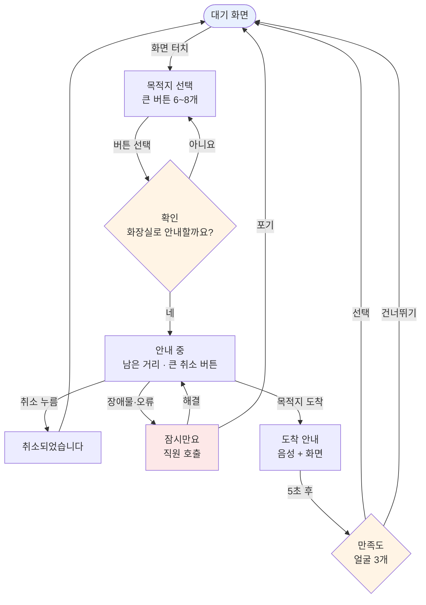
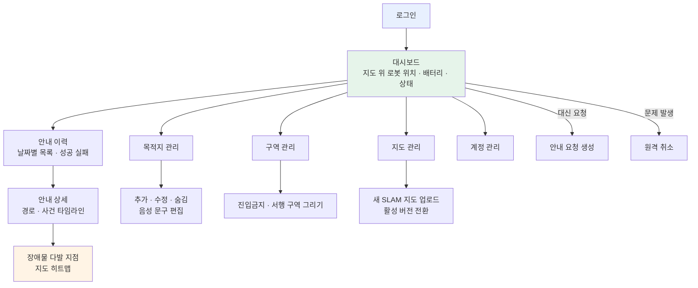

# 화면 흐름 (2단계)

> `docs/REQUIREMENTS.md` 의 사용자 정의에서 이어진다.
> **아직 확정 아님.** 회의에서 `[미결정]` 부분을 정하고 나서 기능 목록을 확정한다.

---

## 1. 어르신 — 로봇 터치스크린 (7인치)

### 화면별 설계 원칙

| 화면 | 원칙 | 이유 |
|---|---|---|
| 목적지 선택 | 한 화면에 **6~8개**, 아이콘 + 짧은 글자 | 7인치에 손가락으로 누를 수 있는 크기 한계 |
| 확인 | 목적지 이름을 **크게 다시 보여줌** | 잘못 눌렀을 때 되돌릴 기회 |
| 안내 중 | **취소 버튼이 화면의 1/3** | 급할 때 정확히 누를 수 있어야 함 |
| 도착 | 화면 + **음성 동시** | 시력·청력 어느 쪽이 약해도 전달 |
| 만족도 | 얼굴 아이콘 3개, **건너뛰기 가능** | 글자를 안 읽어도 됨. 강제하지 않음 |

### `[미결정]`

1. **확인 화면을 넣을 것인가** — 오조작은 막지만 단계가 하나 늘어난다
2. **만족도를 물어볼 것인가, 3단계인가 5단계인가**
3. **도착 판정을 누가 하는가** — 로봇이 좌표 도달로 자동 / 사람이 버튼
4. **오류 시 무슨 문구를 띄우는가** — "경로 계획 실패" 같은 말은 안 된다
5. **음성으로 목적지를 고를 수 있어야 하는가** (⑦)

---

## 2. 직원 — PC 웹

### `[미결정]`

1. **직원이 대신 안내를 요청할 수 있어야 하는가** — 거동이 불편한 분을 위해
2. **원격 취소 권한을 누구까지 주는가** — 안전과 직결
3. **9월에 어디까지 만들 것인가** — 대시보드·이력·목적지관리 3개가 최소선

---

## 3. 이 흐름에서 나오는 상태 변화

화면 흐름을 `trip.status` 와 맞춰본 것이다. **빠진 상태가 없는지 확인하는 용도.**

| 화면 | trip.status | 비고 |
|---|---|---|
| 목적지 선택 → 확인 | (없음) | 아직 trip 생성 전 |
| 확인 "네" | `requested` | trip 생성 |
| 안내 중 | `navigating` | `started_at` 기록 |
| 잠시만요(장애물) | `paused` | `trip_event` 에 기록 |
| 취소되었습니다 | `canceled` | `abort_reason` 기록 |
| 도착 안내 | `arrived` | |
| 만족도까지 끝 | `completed` | `ended_at` 기록 |
| 포기 (오류) | `failed` | `abort_reason` 기록 |

**결과: 8개 화면 상태가 7개 `trip_status` 값에 전부 대응된다. 빠진 것 없음.**
